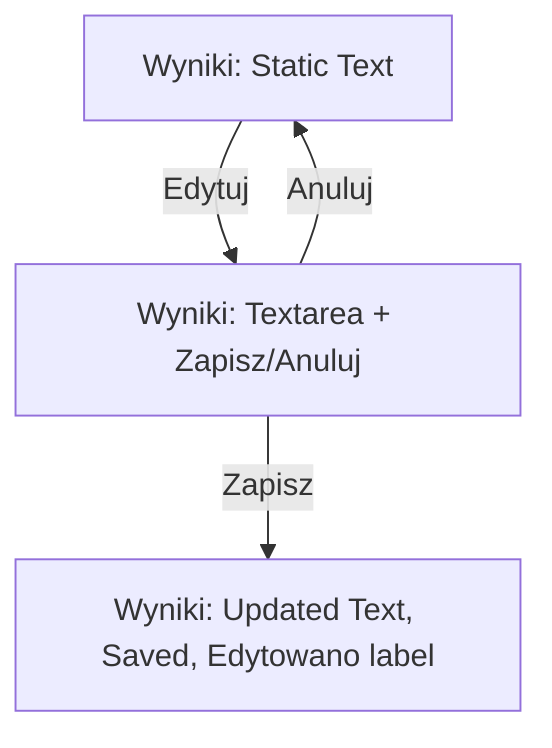

# Plan: Editable, Persistent, and Exportable Generated Content

## 1. Editable Results UI

- Each result in the "Wyniki" section will have an "Edytuj" button.
- Clicking "Edytuj" will turn the result into a textarea (inline editing).
- There will be "Zapisz" and "Anuluj" buttons for each edit.
- If a result has been edited, a small "Edytowano" label will be shown.

## 2. Saving Edited Results

- When "Zapisz" is clicked, the new content is saved to localStorage, updating the correct profile's history.
- The UI re-renders with the updated text and "Edytowano" label.

## 3. Export Logic

- The export to CSV/TXT functions will use the current (possibly edited) content from localStorage.

## 4. Persistence

- On page load, results are loaded from localStorage, including any edits.

## 5. Implementation Steps

1. **Update Results Rendering:**
   - Render each result with an "Edytuj" button.
   - When editing, show a textarea and "Zapisz/Anuluj" buttons.
   - If edited, show "Edytowano" label.

2. **Editing Logic:**
   - On "Edytuj", replace the text with a textarea.
   - On "Zapisz", update the result in localStorage and re-render.
   - On "Anuluj", revert to the original text.

3. **Persistence:**
   - Store edited results in the profile's `history` in localStorage.

4. **Export:**
   - Update export functions to use the latest content from localStorage.

---

**User preferences:**
- Inline editing with "Edytuj" and "Zapisz" buttons.
- Save only when "Zapisz" is clicked.
- Show a small "Edytowano" label for edited results.