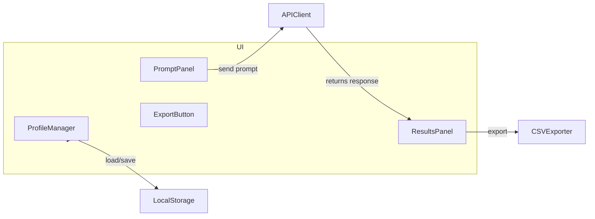

# Plan tworzenia aplikacji desktopowej HTML/JS

## 1. Struktura projektu
- Utworzenie katalogu projektu z plikami:
  - [`index.html`](index.html:1) – główny szablon HTML z załadowaniem Tailwind CSS
  - [`main.js`](main.js:1) – logika JavaScript
  - [`styles.css`](styles.css:1) – dodatkowe style, jeśli potrzeba

## 2. Layout UI (Tailwind CSS)
Mermaid diagram pokazujący moduły i ich zależności:


## 3. ProfileManager
1. Model profilu: `{ id: string, persona: string, history: Array<{prompt,response}> }`
2. Metody:
   - `loadProfiles()` – pobiera z [`localStorage`](https://developer.mozilla.org/docs/Web/API/Window/localStorage)
   - `saveProfiles()` – zapisuje do localStorage
   - `addProfile()`, `editProfile()`, `deleteProfile()`
3. Render listy profili z przyciskami „edytuj”/„usuń”

## 4. PromptPanel + APIClient
1. Sekcja do wpisania promptu i przycisk „Generuj”
2. Przycisk „Generuj dla wszystkich profili”
3. `mockOpenAIAPI(profile, prompt)` – funkcja asynchroniczna zwracająca Promise z przykładową odpowiedzią
4. Przygotowanie miejsca, gdzie wstawić prawdziwe wywołanie:
   ```js
   // TODO: tutaj należy wstawić fetch('https://api.openai.com/v1/…', { headers: { Authorization: `Bearer ${API_KEY}` }, body: … })
   ```

## 5. ResultsPanel
1. Zbiór odpowiedzi: tabela lub lista „ID profilu – odpowiedź”
2. Asynchroniczne wysyłanie równoległe: `Promise.all(profiles.map(p => mockOpenAIAPI(p, prompt)))`

## 6. CSVExporter
1. Generowanie treści CSV:
   ```
   ID,Odpowiedź
   123,"Odpowiedź 1"
   456,"Odpowiedź 2"
   ```
2. Tworzenie obiektu Blob i linku do pobrania

## 7. Obsługa wydajności
- Użycie `async/await` i `Promise.all`
- Virtualizacja list, jeśli lista profili będzie bardzo długa (opcjonalnie)

## 8. Testy manualne
- Dodanie przykładowych profili
- Sprawdzenie CRUD na profilach
- Generowanie odpowiedzi (mock)
- Eksport CSV

## 9. Dokumentacja
- Komentarze w kodzie wskazujące miejsca do podmiany na realne API
- Instrukcja uruchomienia: otwieramy [`index.html`](index.html:1) w przeglądarce